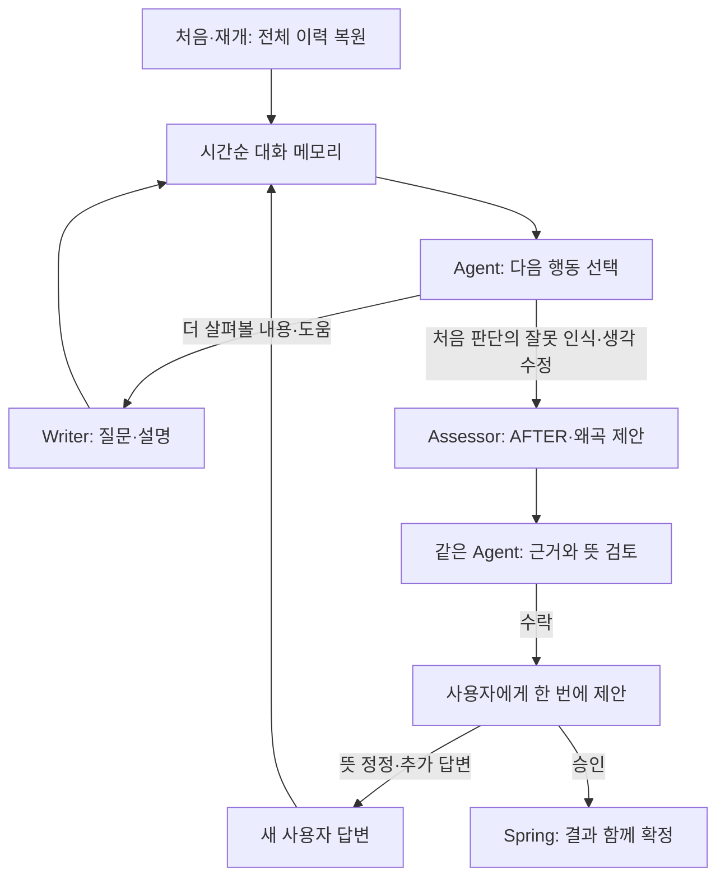

# Mindot CBT AI 전체 로직 재설계

2026-09-09 · 전후 생각·중단 계약 확정 · 구현 후 전체 브랜치 리뷰 · 실행 패키지 연계

**AI가 맥락에 맞는 CBT 질문을 하고, 사용자가 자신의 처음 자동적 생각의 잘못된 판단을 알아차리고 그에 따라 수정한 생각을 AFTER로 정리한다. 처음 자동적 생각인 BEFORE와 AFTER, 대화 근거를 함께 살펴 인지왜곡을 제안한다. 사용자가 승인하면 AFTER와 승인한 인지왜곡을 함께 확정한다.**

이 문서는 이전 동명의 설계안을 교체한다. AFTER를 AI가 자유롭게 제안하는 대안 문구로 해석한 부분, 반대로 사용자가 먼저 AFTER를 직접 입력·확정해야 비교할 수 있다고 설명한 부분을 모두 바로잡는다. 별도 보충 질문 단계도 삭제한다. 현재는 설계 개정이며 구현·테스트 통과 보고서가 아니다.

## 1. 이번에 확정한 의미와 범위

| 항목 | 적용할 의미 |
|---|---|
| BEFORE | 사용자가 처음 가졌던 자동적 생각 |
| AFTER | 사용자가 자신의 처음 자동적 생각의 잘못을 알아차리고 수정한 생각을 AI가 대화 근거에 맞게 정리한 문장 |
| 인지왜곡 제안 | 두 생각의 차이와 실제 대화 근거로 처음 생각에 어떤 추론 문제가 있었는지 설명하는 제안 |
| 사용자 승인 | AI가 정리한 AFTER가 자신의 뜻인지 확인하고, 인지왜곡 제안을 수락 또는 거부하는 최종 확인 |
| 보충 질문 | 완료 평가의 별도 보충 단계·전용 질문 예산은 제거. 필요한 확인은 일반 CBT 질문으로 처리 |
| 수정 권한 | 이번 재설계에 한해 mindot_ai·Spring·React와 연결 DTO·DB·보고서·검색 흐름까지 수정 가능 |

전체 스택 수정은 사용자가 팀원에게 공유하고 명시적으로 허용했다. Spring·React를 외부 담당자의 미승인 작업으로 남기거나, 과거 API를 영구 지원하기 위한 이중 엔진을 만들지 않는다. 이 권한은 이번 CBT 재설계에 한정한다. 사용자는 구현 후 원격 `fix/CBTAI` commit·push를 추가 승인했다. 무관한 기능 변경·develop/main merge·force push·배포·타인 메시지 전송으로 확대하지 않는다.

소스 기준은 AI 결과 ZIP `Mindot-Q11-Simple-Dialogue-Audit-20260909T054802Z.zip`과 내용 일치를 확인한 `fix/CBTAI`의 `e10642279ad0c5fd927f12a188a2e766cc754064`, 주변 제품은 develop `31202b1d6c81bd7132de2b48386d67b2f60253b8`이다. 최신 Blueprint v6·Schema v6는 제품 의도를 참고한 자료이며, 낡은 구현 설명보다 최신 사용자 결정이 우선한다. 실제 코드 흐름은 별도 `Mindot-Project-Flow-Reference-20260909.md`에 보존한다.

## 2. 사용자가 경험할 흐름

1. 이미 기록한 상황과 자동적 생각으로 시작한다.
2. AI가 지금 생각을 살펴보는 데 유용한 질문 하나를 한다. 질문 뜻을 모르겠으면 설명이나 예시를 제공한다.
3. Agent는 답변·정정·도움 요청을 기억하고 다음 질문을 바꾼다. 이미 답한 내용이나 더 없다고 한 내용을 반복하지 않는다.
4. 사용자 답변에서 처음 자동적 생각의 판단이 잘못됐다는 인식과 그에 따른 생각 수정이 드러나는지 파악한다. 두 의미가 대화에 있으면 되고, 정해진 문구나 양식을 요구하지 않는다.
5. 그 인식과 수정이 확인되고 남은 도움 요청 등 즉시 다룰 일이 없으면, AI가 AFTER와 인지왜곡 제안을 함께 만든다. 사용자가 생각을 설명했다거나 질문할 것이 줄었다는 이유만으로 이 단계에 들어가지 않는다.
6. 사용자에게 BEFORE·AFTER·인지왜곡 제안과 이유를 한 화면에 보여 준다.
7. 사용자가 확인하면 AFTER와 수락한 인지왜곡을 함께 저장한다. 뜻이 다르면 대화로 정정하고 수정된 제안을 확인한다.

**AFTER 입력을 먼저 요구하는 별도 화면이나, 비교를 시작하기 위한 사전 승인 단계는 없다.** 기본 흐름에서 최종 확인은 한 번이다. AI의 결과 생성 성공과 사용자의 성찰 결과 확정은 구별한다.

## 3. AFTER가 성립하는 때와 작성 방식

**AFTER는 사용자가 자신의 처음 자동적 생각의 잘못된 판단을 알아차리고, 그 판단을 수정해 갖게 된 생각이다.** 단순한 현재 생각·새 설명·추가 사실·다른 가능성의 나열을 모두 AFTER로 취급하지 않는다.

Agent는 전체 대화에서 두 의미가 연결되는지 판단한다. 어떤 초기 판단을 잘못했다고 보게 됐는지, 그래서 그 생각을 어떻게 수정했는지다. 한 문장에 둘 다 있을 수도 있고 여러 답변에서 드러날 수도 있다. “내가 틀렸다”는 고백이나 왜곡 이름을 요구하지 않는다. 이 판단을 위한 새 분류 LLM이나 매 턴 출력 장부도 만들지 않는다.

예를 들어 BEFORE가 “한 번 실수했으니 나는 일을 못하는 사람이야”이고, 사용자가 “실수 하나로 제 능력 전체를 판단한 건 너무 성급했네요. 다른 일들은 해냈으니 이번 실수만 고치면 되겠어요”라고 답했다면 AFTER는 “이번에 실수했지만 그 하나로 내 업무 능력 전체를 판단할 수는 없고, 이번 실수를 고치면 된다”로 정리할 수 있다. 처음 판단의 문제를 인식하고 생각을 수정한 관계가 있으므로 해당 인지왜곡을 검토한다. 이는 설계 예시이며 실제 생성 결과가 아니다.

| 답변과 맥락 | AFTER·제안 판단 |
|---|---|
| “질문은 이해했어요”, 단순 맞장구 | 처음 판단의 수정 근거가 아님 |
| 같은 생각을 더 자세히 설명함 | 설명의 증가만으로 AFTER가 생기지 않음 |
| “다른 이유도 있을 수 있겠죠” | 가능성 나열만으로 부족. 실제로 처음의 단정을 수정한 뜻인지 문맥으로 확인 |
| “답장이 늦다고 날 싫어한다고 단정한 건 근거가 없네요. 아직 이유를 모르는 거죠” | 근거 없는 단정을 알아차리고 불확실성을 인정하도록 바뀜. 긍정적 확신이 아니어도 AFTER 가능 |
| “그래도 제 생각은 같아요”, 맥락 없는 “아직 모르겠어요” | 잘못 인식과 생각 수정이 드러나지 않았으므로 AFTER를 채우지 않음 |
| “처음 기록에 오타가 있었어요” | 기록 정정만으로 CBT에 따른 생각 변화가 되지 않음 |

AI는 실제 변화를 자연스럽게 의역·종합할 수 있다. 원문을 그대로 복사하거나 사용자가 AFTER를 별도 입력할 필요는 없다. 다만 사용자에게 없던 확신·경험·긍정적 결론을 보태지 않는다. 일부 잘못된 판단만 수정됐다면 그 범위를 유지하고 생각 전체가 완전히 바뀌었다고 확대하지 않는다.

이후 생각의 불확실성이 남아 있어도 처음의 잘못된 단정을 수정했다면 AFTER가 될 수 있다. 반대로 모르겠다는 답변 자체는 변화의 증거가 아니다. 구체적인 유형 제안은 실제 변화와 기존 정의를 대조해 결정한다. 사용자가 잘못을 느꼈다는 사실만으로 모든 제안 유형이 맞다고 확정하지 않는다.

AFTER가 아직 없으면 유용한 일반 CBT 대화를 이어가거나 사용자의 중단을 존중한다. 처음 생각이 실제로 정확하거나 더 탐색할 이유가 없을 때 잘못을 인정할 때까지 질문하지 않는다. 변화 없이 대화를 멈추는 상태는 기존 이어하기/중단 경로로 보존할 수 있으며, 이를 AFTER가 생긴 성찰 완료·변화 패턴으로 저장하지 않는다.

처음 기록 오류는 원문을 보존하며 실제 BEFORE를 바로잡는 문제다. 현재 생각이 바뀌었다는 답변으로 BEFORE를 덮어쓰지 않는다. 잘못 기록된 문장과 정정된 평가 대상은 필요한 경우 결과 화면에서 구분한다.

## 4. 필요한 구성요소만 남긴다

| 구성요소 | 책임 |
|---|---|
| Agent | 시간순 대화 이해, 정정·도움·현재 생각 파악, 다음 질문 목표와 도구 선택 |
| Writer | Agent가 정한 질문·설명·예시를 자연스럽게 표현 |
| Assessor | 초기 판단의 잘못 인식과 수정 근거를 확인해 AFTER 정리, BEFORE와 비교하여 유형과 이유 제안 |
| 같은 Agent의 최종 검토 | AFTER가 사용자 뜻을 넘어갔는지, 정정을 무시했는지, 제안 근거가 맞는지 확인 |
| Spring | 영구 기록, 요청 순서, 미확정 제안, 사용자 승인, 최종 저장과 후속 분석 |
| React | 대화·제안·승인 화면. 서버가 보내 준 세션 상태를 표시 |

실제 LangGraph Agent와 도구 호출을 유지한다. 새 추출기·검증 LLM·질문 채점 LLM은 추가하지 않는다. 일반 턴은 작성 목표만 전달하고, 모든 답변의 분류표·GOAL·정정 범위·요청 이행 장부를 출력하지 않는다.

최종 검토는 Assessor 결과에만 한 번 적용한다. 잘못된 사용자 생각을 결과로 확정하는 위험을 줄이는 기존 역할이다. 일반 질문의 문체를 다시 채점하거나 의미 실패 뒤 여러 모델을 돌려 합의하는 구조로 확장하지 않는다. 이 검토가 실제 오류를 충분히 잡는지는 완료 경로의 실모델 평가로 확인해야 한다.

## 5. 별도 보충 질문 단계를 제거한다

Assessor는 결과를 제안하며 질문을 작성하지 않는다. `FACT_BOUNDARY_REQUIRED`, gap, 보충 1회 예산, 생략 철회용 보충 대기 상태, 질문 코드에 숨긴 보충 표식과 그 복원 검사는 삭제한다.

필요한 사실 확인은 Agent가 일반 CBT 질문으로 선택한다. 일반 질문·설명·정정·중단 기능은 그대로 있다. 같은 내용을 이미 답했거나 답할 수 없다고 했으면 이름을 바꿔 다시 묻지 않는다. 성찰 끝에 별도 질문 단계를 추가해 모든 왜곡의 부재를 입증하게 하지 않는다.

초기 판단을 잘못됐다고 인식해 수정한 근거가 없으면 AFTER와 인지왜곡 제안 단계에 들어가지 않는다. 기존 ‘왜곡 없음·판단 유보’ 상태도 이 조건을 우회해 변화 없는 답변을 AFTER로 채우는 근거가 아니다. 실제 변화는 있지만 특정 유형 판단이 어려운 경우에는 억지 라벨을 붙이지 않고 그 한계를 표시할 수 있다. 이를 또 다른 보충 질문 장치로 해결하지 않는다.

명시적 중단과 명확한 현재 긴급 위험의 기본 경로는 남긴다. 잠깐 나간 상태는 진행 기록을 유지하고, 영구 취소는 Spring에서 취소 상태로 확정한다. 과거·타인·인용의 위험을 현재 사용자 위험으로 기계적으로 단정하지 않는다.

### 중단·완전 종료·결과 승인의 구분

기준 React 코드에 이미 있는 ‘나중에 이어하기’와 ‘성찰 완전히 중단’ 버튼을 활용한다. 화면에서 후자의 문구를 ‘성찰 완전히 종료’로 명확히 할 수 있지만 별도 종료 상태나 판별 모델은 추가하지 않는다.

| 사용자 동작 | 세션 처리 | 결과 처리 |
|---|---|---|
| 나중에 이어하기 | OPEN 유지, 저장된 문답·현재 제안을 이후 복원 | 아직 승인하지 않은 AFTER·유형은 확정하지 않음 |
| 성찰 완전히 종료 | 기존 cancel API로 CANCELLED, 이 세션 재개 불가 | 문답 보존. AFTER·유형을 새로 만들거나 자동 승인하지 않음 |
| 제안 승인·저장 | COMPLETED | 성립 조건을 만족하는 AFTER와 사용자가 승인한 유형을 함께 확정 |

생각 변화 없이 마치려는 사용자도 완전 종료 버튼을 사용할 수 있다. CANCELLED는 내부 상태명이며 사용자 선택에 따른 종료이지 기술 실패·왜곡 없음·CBT 변화 성공의 판정이 아니다. 변화 사례 집계·RAG에는 사용자 승인 완료 결과만 사용한다. 종료를 위해 AFTER를 만들어낼 필요가 없다.

자연어 중단 의사는 질문을 멈추고 기존 두 버튼으로 선택할 수 있게 안내한다. 모델이 ‘그만’의 의미를 추측해 영구 종료를 확정하지 않는다. 영구 종료는 사용자의 기존 버튼 동작과 cancel API가 담당한다. 기존 확인 대화상자를 재사용하며 별도 승인 단계를 더하지 않는다.

## 6. 요청과 복원 흐름을 함께 바꾼다

**Spring은 영구 원문을 보관하고, Agent는 진행 중 대화를 기억한다. 처음·재개에는 전체 이력, 이후에는 새 답변만 전달한다.**

현재 React→Spring turn 본문은 `{"answer":"…"}`지만 Spring→AI는 전체 이력 DTO를 반복한다. 이번에는 두 서버의 계약을 함께 바꾼다. 사용자에게 전체 이력을 다시 보내게 하지 않는다.

| 동작 | 목표 흐름 |
|---|---|
| 처음 열기 | Spring이 기록·세션을 준비하고 AI에 전체 시작 문맥 전달. 첫 질문 생성 |
| 다시 열기 | Spring DB의 실제 대화·미확정 제안을 AI에 복원. 복원 자체에는 모델 호출 없음 |
| 답변하기 | Spring이 새 답변을 먼저 저장하고 AI에 새 답변만 전달. AI는 자기 질문과 답변을 순서대로 누적 |
| AI 메모리 유실 | AI가 복원 필요를 반환. Spring이 전체 이력으로 복원한 뒤 같은 요청을 이어감 |
| 결과 확인 중 재개 | 이미 저장된 AFTER와 왜곡 제안을 다시 표시. 같은 결과를 재생성하지 않음 |
| 생성 실패 | 사용자 답변은 보존. 재시도는 저장된 답변으로 생성만 수행 |
| 승인 | Spring이 제안 버전과 사용자 확인을 확인하고 결과를 한 번에 확정 |
| 취소 | Spring에서 취소를 확정하고 늦게 도착한 AI 응답을 저장하지 않음 |

공개 API는 새 시작·재개를 하나의 open 동작으로, 생성 실패 재시도를 하나의 retry 동작으로 묶는다. 모든 응답은 같은 SessionView를 반환해 React가 질문 코드나 화면 문자열로 상태를 추측하지 않게 한다. 세부 DTO는 계약 문서에 정리한다.

기존 `AiJobs`를 재사용하고 동일 사용자 요청을 구별하는 키와 세션 revision으로 중복 저장·늦은 저장을 막는다. 사용자 답변 저장과 결과 저장에 각각 짧은 트랜잭션을 사용하고 모델 응답을 기다리는 동안 DB 트랜잭션을 유지하지 않는다. 새 큐·별도 워크플로 서버·실시간 스트리밍은 이번 기본 구조에 추가하지 않는다.

메모리와 DB를 두 개의 동등한 정본으로 취급하지 않는다. Spring DB가 복원 기준이며, AI 메모리는 실행 상태와 성공 응답의 임시 캐시다. 네트워크 실패 후에도 전 세계적으로 모델 호출이 정확히 한 번만 일어난다고 보장하지 않는다. 논리 답변의 중복 저장을 막고, 성공 응답이 남아 있으면 재사용한다.

## 7. 승인과 저장을 하나의 결과로 묶는다

기본 제안 화면에는 BEFORE, AI가 정리한 AFTER, 인지왜곡 제안과 이유를 함께 보여 준다. 초기 판단의 잘못을 알아차리고 수정한 생각이 사용자 답변의 뜻에 맞는지 확인하도록 한다. 승인 전 데이터도 재개를 위해 저장하지만 확정 사례로 집계하거나 검색에 사용하지 않는다.

- 사용자는 제안한 유형을 수락하거나 거부한다. 왜곡을 인정해야 저장되는 구조가 아니다.
- 이미 제안을 보여 준 뒤 단순 동의나 부연 설명만으로 같은 제안을 다시 만들지 않는다. 새 후보는 기존 AFTER나 유형을 바꿀 실질적 정정·탐색 근거가 있을 때만 작성한다.
- 제안의 뜻을 묻는 단순 설명 요청에는 기존 제안을 유지하며 설명한다. 실제 생각·사실 정정이 함께 있으면 그대로 유지하지 않는다.
- AFTER가 자신의 뜻과 다르면 기존 답변 입력으로 정정한다. 실제 생각 수정이 여전히 뒷받침되면 AFTER와 유형을 함께 다시 제안한다. “생각이 바뀐 게 아니다”라는 정정이면 후보를 철회하고 일반 대화로 돌아가며 다른 AFTER를 자동으로 만들지 않는다.
- 이 경우 이전 제안은 이력으로 보존하고 승인 대상에서는 제외한다. 수정된 AFTER에 이전 제안의 라벨을 몰래 붙여 저장하지 않는다.
- 기본 화면의 AFTER를 임의로 바꾸고 옛 라벨로 바로 승인하는 경로는 없앤다. 정정 기능은 대화로 유지하므로 별도 문장 편집 판별기나 글자마다 재평가하는 호출이 필요 없다.
- 최종 승인 요청은 AFTER를 새로 전송해 덮어쓰는 요청이 아니라, 현재 제안 식별자·사용자 유형별 검토·점수를 확인하는 요청이다.

저장할 핵심은 실제 BEFORE, AFTER, AI의 제안과 이유, 사용자가 수락·거부한 결과다. 별도의 BEFORE 유형 배열과 AFTER 유형 배열을 생성해 차집합을 계산하지 않는다. 왜곡 없음·판단 유보·사용자 전부 거부·기술 실패를 빈 배열 하나로 합치지 않는다.

전후 확신도는 기존 의미를 유지한다. 두 값은 **처음 자동적 생각을 전과 후에 얼마나 믿는지**를 묻는 척도다. AFTER 문장에 대한 자신감과 몰래 비교하지 않는다. 감정 강도와 도움 정도도 사용자가 입력하며 AI가 대신 추정하지 않는다.

## 8. 화면 밖의 후속 영향

| 연결 지점 | 함께 수정할 내용 |
|---|---|
| Spring 결과 저장 | AFTER와 같은 후보에서 나온 왜곡 제안을 함께 저장. 승인 이후 확정 결과만 노출 |
| React | 전후 라벨의 독립 분류 화면을 한 쌍의 생각과 왜곡 제안 화면으로 정리. 정정·거부·재개 반영 |
| 미확정 결과 재개 | 결과 제안 전체를 상세 응답에 포함. 새로 생성하지 않고 복원 |
| 주간 보고서 | BEFORE/AFTER 라벨 차집합의 REMOVED/PERSISTED/NEW를 새 결과에 사용하지 않음. 실제 생각, 사용자 수락 유형, 확신도 변화로 설명 |
| 검색·RAG | 승인 완료한 실제 AFTER와 사용자 확인 결과를 사용. 미승인 제안은 사례에서 제외 |
| 임베딩 | 문맥 벡터·처음 생각 포함 벡터의 기존 목적 유지. 최초 생각 정정이 승인되면 일관된 BEFORE 사용 |
| PDF·기록 상세 | 같은 승인 결과를 표시. AI가 제안한 문구와 사용자가 확인한 문구를 다른 값으로 조합하지 않음 |
| 기존 데이터 | 기존 문답·확정 기록을 보존. 출처 불명 대안 문구를 새 계약의 사용자 AFTER로 추측 변환하지 않음 |
| 취소·중복·실패 | 현재 작업·세션 상태를 확인한 결과만 저장. 임베딩 실패가 성찰 승인을 취소하지 않음 |

현재 RAG 벡터가 모든 대화나 AFTER를 이미 임베딩한다고 가정하지 않는다. 확인한 구현은 상황 문맥과 처음 생각 포함 문맥의 두 벡터다. 새 결과를 꺼내 보여 주는 부분과 벡터를 만드는 부분을 구분해 수정한다.

새 데이터에는 결과 형식 버전을 기록한다. 기존 AFTER 라벨이 비었다는 이유로 왜곡이 개선됐다고 소급 집계하지 않는다. 기존 진행 중 세션은 실제 문답을 복원해 새 제안을 받고, 이미 완료한 기록은 당시 결과라는 표시와 의미를 보존한다.

DB 마이그레이션을 사용하지 않는 기존 방침을 따른다. 기존 question_answers를 읽을 때 Agent용 시간순 messages로 구성하면 되며, 과거 DB 데이터를 일괄 이관할 필요는 없다. 마이그레이션 도구·이관 스크립트를 새 필수 작업으로 넣지 않는다. 필요한 엔티티·테이블·컬럼 변경은 DTO/메모리 표현 변경과 구분해 기존 DB 관리 방식으로 적용한다.

## 9. 검증과 호출을 줄이는 기준

남기는 검사는 실행에 필요한 구조, 요청·세션·revision 연결, 실제 최종 인용 존재, 승인한 제안의 일치, 저장·취소·용량 경계다. 같은 뜻을 여러 상태표에 반복 작성하게 하는 검사와 문체 수준의 차단은 삭제한다.

| 동작 | 생성 호출 |
|---|---:|
| 질문·설명·예시 | Agent → Writer, 2회 |
| AFTER와 왜곡 제안 | Agent → Assessor → 같은 Agent, 3회 |
| 이미 받은 제안 표시·사용자 승인·단순 복원 | 0회 |
| 제안 정정 후 재작성 | 새 사용자 답변으로 필요한 일반 경로, 요청당 최대 3회 |
| Writer 순수 형식 복구 | 같은 목표로 1회 추가, 요청 전체 최대 3회 |

Moderation은 별도 최대 1회다. Assessor 뒤 별도 보충·Writer·추가 검증 모델은 없다. 사용자의 정정은 정상 새 입력이고 자동 성공 재시도와 구별한다.

호출당 추정 입력 48,000토큰·UTF-8 직렬화 입력 196,608바이트를 유지한다. 이 값은 프로젝트 설정이다. 최신 실패 실행의 최대 추정 입력은 6,486토큰/25,516바이트여서 용량 부족이 이번 실패의 설명은 아니다. 첫 실행 전에 새 구조의 정상 요청을 측정하되 필수 원문 삭제나 복잡한 ID 압축을 다시 넣지 않는다. 출력 한도와 전체 평가 누적 예산은 별도로 관리한다.

## 10. 전체 흐름을 대입한 검토

| 확인할 연결 | 원하는 결과 |
|---|---|
| 질문 → 잘못된 판단 인식·수정 → 제안 | 명시적 고백·AFTER 양식 없이 의미로 파악하고 실제 수정 범위대로 정리 |
| 단순 맞장구 → 다음 질문 | 이해했다는 반응만으로 생각 변화 발명 금지 |
| 도움과 실질 답변 혼합 → 정정 → 제안 | 답변 내용과 정정 범위 보존. 도움을 제공했다고 실제 내용 유실 금지 |
| 더 없음·반복 항의 → 다음 행동 | 같은 탐색 반복 금지. 일반 초안 기능을 새로 요구하지 않음 |
| 정확한 생각·변화 없음 → 대화/중단 | AFTER·왜곡 제안 생성 없음. 억지 변화·잘못 인정 강요 없음 |
| 제안 → 뜻 정정 → 새 제안 → 승인 | AFTER와 라벨의 기준이 함께 갱신되고 이전 후보 승인 불가 |
| 답변 저장 → 메모리 유실 → 복원 | 같은 답변 한 번만 기록하고 문맥을 이어감 |
| 결과 제안 → 종료 후 재개 → 승인 | 동일 제안 표시, 불필요한 LLM 재호출 없음 |
| 취소·중복 요청·저장 실패 | 늦은 결과나 재전달로 다른 단계·결과를 덮어쓰지 않음 |

오프라인 검사는 저장·복원·승인 등 기계적 관계를 확인한다. 실제 모델 평가에서는 잘못된 판단의 인식과 수정이 있는 경우에만 AFTER·유형 제안 경로를 실행하는지 확인한다. 단순 설명·맞장구·변화 없음에서 제안하지 않는 것도 정상 동작으로 평가한다. 모의 출력을 주입한 통과를 이 능력의 증거로 보고하지 않는다.

새 rubric v1.13·공개 cbt-known-insight-1·canary cbt-insight-canary-1·공통 blind 형식을 구현 패키지에 함께 제공한다. 기존 v1.12·공개 scope-2·과거 raw는 보존하며 과거 실패를 소급 재채점하지 않는다. 봉인 14개는 열지 않았다. 이번 구현 지시는 테스트 실행 권한의 활성화가 아니며 아래 전체 브랜치 리뷰 순서를 따른다.

## 11. 현재 산출물 상태

설계·API와 데이터 계약·완성 제품 프롬프트 5개·작성 규칙·평가 기준을 이번 사용자 설명에 맞춰 갱신했다. 실제 제품 소스 수정, 오프라인 테스트, canary, 유료 API 호출은 실행하지 않았다. 마지막 공식 결과 수집 상태는 0/368 그대로다. 다음 구현 지시는 이번 전체 스택 권한과 현재 계약을 한 문서에 통합하며, 이전 지시가 이미 적용됐다고 전제하지 않는다.

함께 볼 핵심은 AFTER가 사용자 답변보다 강한 결론이 되지 않는지, 다음 질문을 멈출 시점이 자연스러운지, 사용자 정정과 승인 결과가 끝까지 같은 내용으로 저장되는지다.

관련 문서: `Mindot-CBT-Redesign-Contracts.md`, `Codex-Prompt-Authoring-Rules.md`, `Mindot-Project-Flow-Reference-20260909.md`.

## 12. 구현 전달과 전체 브랜치 리뷰

순서는 Codex 구현 → 원격 fix/CBTAI push → ChatGPT의 해당 SHA 전체 소스 리뷰 → 테스트다. 현재 원격 확인 SHA는 `92618c194e8a70a13a8913425b5d396aea359e10`이며 기존 기준 이후 기록 목록·정렬·화면의 7개 커밋이 추가됐다. AI 변경은 이 비교에 없다. 실제 구현은 시작 시 최신 원격을 확인하고 팀원 변경을 보존한다.

Codex는 제품·테스트 코드와 실행 준비를 완료하고 소스·영향 지도·원격 SHA를 제출한 뒤 멈춘다. ChatGPT는 diff만 보지 않고 세 앱의 전체 자사 소스와 설정, 기록·인증·대화·승인·보고서·검색·기존 결과 소비자를 추적한다. 막는 결함은 수정 후 다시 확인한다. 읽지 못한 영역과 실행이 필요한 항목은 명시한다. 정적 리뷰 통과는 이후 테스트에 진입할 수 있다는 뜻이며 런타임 무결함 보장이 아니다.
