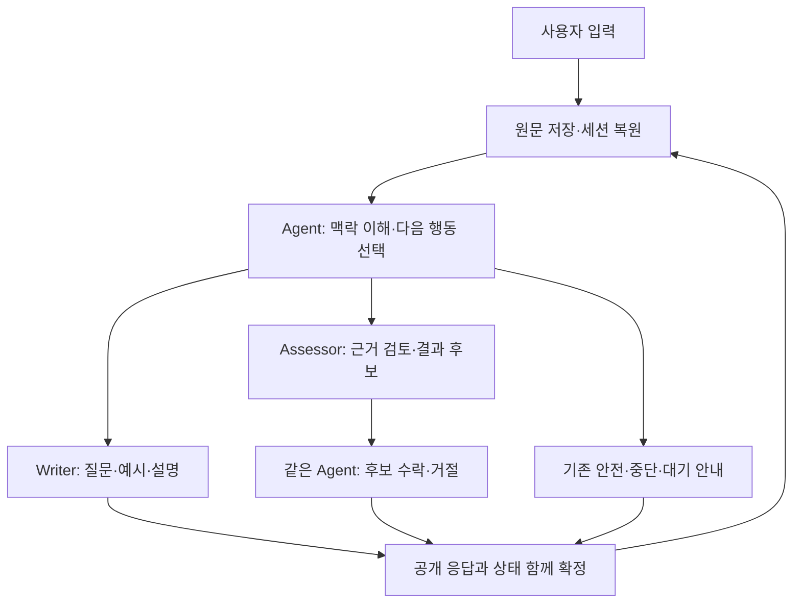

# 대화 중심 단순화 계약

계약: `simple-dialogue-2` · 2026-09-09 · 상태: 설계 완료용 명세, 제품 미구현·미실행.

현재 구현된 simple-dialogue-1의 2026-09-09T043047Z 제출본에서 이어지는 수정 명세다. 이 계약은 실제 구현·canary 통과를 의미하지 않는다. 이전 REPAIR-13을 출발점으로 다시 구축하지 않는다. 현재 worktree 차이를 보존하고 최신 제출본의 cbt_simple 경로를 최소 수정한다. 기존 역할·공개 API·원문 저장 구조는 유지한다.

제품 범위와 테스트 작성 판단은 `product-scope-and-test-policy.md`를 따른다. 사용자 명령에 따른 자유 초안 생성 기능은 추가하지 않는다. 이번 수정은 일반 질문 target의 중복 의미 제거, 실제 최신 발화의 명확한 배치, 구체적인 질문 목표, 기존 정정·중단 의사 반영과 테스트 오류 교정이다.

## 1. 목적과 변경량

사용자가 말한 내용을 이해한 뒤 지금 도움이 되는 질문 하나를 선택한다. 정상적인 답변을 받기 위해 먼저 모든 답변을 네 영역으로 분류·인용하고 수많은 slot·request alias를 일치시켜야 하던 구조를 제거한다.

| 기존 필수 작업 | 이번 계약 |
| --- | --- |
| SELECT에서 모든 required source의 contributions·role·signals·gapAnswer 작성 | 제거. 원문을 읽고 행동을 선택한다. 필요한 대화 상태 변화만 선택적으로 기록한다. |
| source 수만큼 확장된 tool schema·enum·slot/wire map | 제거. 고정 schema에 짧은 실제 ID를 사용하고 서버가 존재·종류·현재성을 한 번 검증한다. |
| 네 coverage 모두 complete여야 Assessor 허용 | 제거. Agent가 평가 요청의 이유를 제안하고 Assessor가 실제 근거로 판단한다. |
| SELECT마다 safetyReview, correction·gap·request 전체 빈 구조 제출 | 제거. 관련 사건이 있으면 작은 event만 작성한다. |
| 같은 판단을 planner→compiler→tool→render가 재검증 | 제거. 한 경계에서 검증한 불변 action/candidate를 전달한다. 마지막 공개 DTO 검사는 유지한다. |
| 문장부호·종결어미·줄바꿈·내부 220자 강제 | 제거. 공개 DTO의 길이·필수 필드와 정상 렌더링만 집행한다. |
| 오류 후 전용 재검토 phase 다수 | 제거. 일반 문장 출력의 형식 복구 한 번만 허용한다. 완료의 Agent 최종 검토는 유지한다. |

## 2. 실제 실행 구조

일반 질문·예시·설명은 SELECT→Writer 2회다. 완료 시 SELECT→Assessor→같은 Agent review 3회다. 안전·제어는 SELECT 이후 결정론적 안내로 1회다. 정상 형식 복구가 필요한 Writer만 세 번째 호출을 쓸 수 있다. 턴당 생성 최대 3회, Moderation 최대 1회, SDK retry 0회. 별도의 safety-recheck·argument-repair·coverage-review phase를 새 경로에서 실행하지 않는다. safety 해소/재개는 다음 정상 SELECT가 원문과 episode를 보고 결정한다.

tool은 기존 다섯 이름 `write_turn`, `present_pending_question`, `assess_completion`, `respond_control`, `respond_safety`를 유지한다. 모든 것은 실제 등록 callable이고 실제 ToolMessage와 call ID를 기록한다. Writer와 Assessor를 가짜 도구나 독립 서버 정책 엔진으로 바꾸지 않는다. 전체 메모리와 checkpoint는 Agent graph와 연결한다.

## 3. 최소 메모리와 입력

저장의 원본은 기존 raw ledger와 실제 질문·응답 이력이다. revision, session identity, 처리 실패 입력, 기존 checkpoint와 성공 응답 cache를 보존한다. 별도 사실 DB나 요약 LLM은 추가하지 않는다.

현재 턴의 논리 입력은 아래 자료다. 저장된 원문은 유지하고 전송 메시지에서만 아래 배치를 적용한다.

- `record`: 비텍스트 metadata와 situation/automaticThought를 가리키는 ID.
- `sources`: 원문 ID, 종류, 현재/과거 revision, text. 최신 메시지로 옮긴 source 외의 text를 담으며, 각 원문은 전체 입력에 한 번만 둔다.
- `conversation`: 시간순 공개 questionCode·questionPurpose·semanticRouteType·질문 원문과 answerSourceId. 과거 내부 focus/move/plan 전체를 매 질문에 재전송하지 않는다. Assistant 예시는 사용자 사실과 구분한다.
- `dialogue`: 현재 질문, 닫힌/생략/재개한 목표, 미이행 도움 요청, 활성 정정, 원래 생각의 평가 대상 상태, rejectedCodes. 의미 설명은 짧은 한 문장과 원문 ID로 연결한다.
- `gap`·`safety`·`stop`: 사건이 있거나 보존할 사용 이력이 있을 때만 제공한다. 빈 episode 슬롯이나 예약 alias는 만들지 않는다.
- `budget`: 실제 남은 생성 호출권, gap 사용 여부 등 실행에 필요한 수치만 제공한다.

일반 턴에는 새 원문과 현재 대화가 이미 있으므로 내용 추출 reviews를 요구하지 않는다. 과거의 확정 판단을 다시 출력할 의무가 없다. cold REHYDRATE에서도 공개 질문·답변을 먼저 복원해 동일 SELECT가 읽는다. 들어온 이력의 숨겨진 goal·correction·gap receipt를 존재했던 것처럼 재구성하지 않는다. 실제 checkpoint가 있을 때만 정확한 상태 복원이라고 한다.

우선 현재 세션의 실제 원문과 질문 전체를 중복 없이 제공한다. 새로운 요약·검색 정책, source 32개/review 8개 상한, 동적 schema expansion은 넣지 않는다. 원문 수정 전 이력도 저장하며 활성 철회·복권과 연결된 과거 원문은 읽을 수 있게 한다. 수치 판단 근거는 `input-capacity-decision.md`다. 입력의 정식 기본값은 48,000 추정 tokens/196,608 bytes(192 KiB)다. 일회성 예외나 모델 자체 한도가 아니다. 정상 대표 요청에 부족하면 첫 canary 전 실행 계약의 측정 기반 절차로 입력/bytes 설정을 조정한다. 필요한 원문을 자르거나 별도 검색·요약 구조를 추가하지 않는다. 실제 잠긴 effective 설정을 초과한 실행 요청은 용량 실패로 보존하며 평가 중 설정을 조용히 바꾸지 않는다. 이는 무한 길이 세션 지원 약속이 아니다.

### 이번 발화와 현재 문답의 전송

SystemMessage는 역할 지시다. 첫 HumanMessage는 원문 이력·현재 효력·상태이며 마지막 HumanMessage는 이번 실제 발화의 sourceId와 text, 연결된 실제 questionCode다. 같은 source의 text를 context.sources와 마지막 메시지에 두 번 넣지 않는다. context에는 ID·종류·현재성·철회 범위와 `textLocation=LATEST_MESSAGE` 참조를 남긴다. 원문 저장 객체를 직접 삭제·변경하지 않고 별도 전송 projection에서만 구성한다.

최신 발화는 이번 공개 요청과 이전 확정 요청의 실제 추가·수정 관계에서 결정한다. START는 실제 situation/automaticThought를 제공한다. cold 복원은 공개 currentStep과 해당 문답으로 연결하며, 이전 답변 수정이 있으면 실제 수정 source도 전달한다. 원문 여러 개가 바뀌었으면 모두 한 번씩 제공하고 사용자 문장을 합성하지 않는다. 가장 큰 S번호·마지막 ledger 원소를 최신으로 추측하지 않는다. 새 발화가 없으면 없다고 명시한다. currentStep이 없을 때는 공개 요청에서 실제 마지막 문답과 변경된 source의 관계만 사용하며, 유일한 관계가 없으면 현재 질문 참조를 null로 둔다. pendingQuestion을 추측해 만들지 않는다.

현재 응답이 연결된 질문과 아직 답변을 기다리는 pendingQuestion은 다른 정보다. cold 입력에 currentStep이 있어도 가짜 pendingQuestion이나 미답변 상태를 만들지 않는다. 서버는 현재 문답 참조만 전송용으로 계산한다. 이는 일반 질문을 재출제하는 실행 target이 아니다.

SELECT·Writer·Assessor·Agent 최종 review는 각자가 필요로 하는 동일 원문에 접근해야 한다. phase 입력을 구성하는 한 helper가 원문 위치를 해석하고, SELECT에서만 옮긴 text가 다음 phase에서 사라지지 않게 한다. review의 실제 AI tool call–ToolMessage 쌍은 보존한다. 전송 projection은 checkpoint에 저장하는 원본이 아니다.

모델 ID는 현재 요청 view의 짧은 실제 ID다. lookup table은 서버가 한 번 만든다. 모델 schema에는 ID 목록을 enum으로 반복 삽입하지 않는다. 인용 내용의 문자열 치환은 금지한다. ID 존재 검사는 충분하지만 그것만으로 사실성·의미 적합성이 입증되지는 않는다.

## 4. 선택적 상태 변화

각 tool의 `updates`는 없으면 null이다. 있으면 `events` 배열만 갖는다. 해당 원문에서 실제 사건이 발생했을 때만 작성한다. 빈 배열의 필수 제출·모든 source별 객체·네 영역 역할 분류는 없다.

| event | 필드와 의미 |
| --- | --- |
| GOAL | questionCode, status=ANSWERED/NONE/SKIPPED/REOPEN, sourceId, note. 기존 질문 목표의 상태 변화. NONE은 실제 명시적 부재, SKIPPED는 생략·거부다. |
| CORRECTION | operation=RETRACT/REAFFIRM, targetSourceId, targetQuote 또는 null(전체), occurrence 또는 null(전체), sourceId, instructionQuote. Agent가 명시적 정정의 의미·대상을 선택한다. |
| REQUEST | sourceId, quote, kind=EXAMPLE/EXPLANATION, targetQuestionCode 또는 null. 이번에 처리하지 않은 추가 도움 요청만 등록한다. |
| REQUEST_UPDATE | requestId, operation=CANCEL/RETARGET, sourceId, targetQuestionCode 또는 null. 실제 기존 요청의 변경이다. |
| RESUME | scope=DIALOGUE/SAFETY, targetId, sourceId, reason. 중단 뒤 명시적 재개 또는 활성 안전 상태의 문맥상 해소. |

일반 정상 답변을 먼저 근거 atom으로 바꾸어야 상태가 저장되는 구조는 없다. 사용자 원문은 항상 저장된다. GOAL은 대화 흐름 메모이고 사실 인증이 아니다. 일반 GOAL 상태는 질문·평가의 허가표가 아니며 모두 닫거나 매 답변마다 제출할 의무가 없다. source/question 존재 검증과 실제 gap에 연결된 답변·SKIP·REOPEN 효력은 유지한다. NONE을 쓰기 위해 다른 미탐색 영역까지 없음으로 채우지 않는다. Agent의 부적절한 의미 판단을 서버의 키워드 분류기로 대신하지 않는다.

CORRECTION은 수정 발화의 실제 인용과 대상 범위를 검증한다. 범위가 유일하지 않으면 occurrence로 지정하고, 판단 불가능하면 `respond_control(CLARIFY_TARGET)`을 선택한다. 서버는 원문 시간순으로 기존 유효성 reducer의 부분 철회·복권 의미를 유지한다. 복권된 구절의 중복 사용을 막으며, 철회로 무효화된 파생 결과·SKIP·요청 이행을 자동 복권하지 않는다. 사실 근거는 새 Assessor 호출 때 현재 유효성으로 읽는다. 새로운 내용은 수정 발화 자체의 raw source에 있으므로 replacement contribution을 요구하지 않는다.

기존 goal/request/gap/episode ledger를 저장 원본으로 재사용할 수 있다. 단 새 경로의 update를 다시 옛 accept_batch/reviewSlots 계약으로 바꾸기 위해 가짜 reviews를 만들지 않는다. 순수 저장 helper와 reducer만 분리해 재사용한다. 같은 turn draft에서 순서대로 한 번 적용하고 응답 성공 시 함께 commit한다.

### 도움 요청

`present_pending_question`은 request 하나만 받는다. NEW는 sourceId·quote·kind·targetQuestionCode를 한 번 지정한다. EXISTING은 실제 requestId만 선택한다. 선택한 NEW 요청은 별도 REQUEST event에 중복 작성하지 않는다. 서버가 일치하는 이미 등록된 source/범위/종류/대상을 찾으면 같은 요청으로 재사용한다. 남은 요청은 보존하고 취소·대상 변경을 적용한 현재 draft에서 선택한다. 요청 대상은 발화 출처와 다를 수 있다. 불명확할 때만 대상 확인 안내를 사용한다. 예시 두 개는 요청 하나다.

요청이 raw에 있다고 자동 fulfilled로 처리하지 않는다. 실제 예시·설명 응답이 성공적으로 commit될 때 해당 요청만 이행한다. 예시 생성물은 사용자 사실·동의·coverage가 아니다. 같은 사용자 답변 속 실질 내용은 raw에서 그대로 살아 있고, Assessor는 필요한 때 그 원문 전체를 읽는다.

### 보충·안전·중단

기존 보충 질문 사용 이력(세션당 최대 1회), 실제 질문과 답변/SKIP의 연결, 정정 후 답변 대기를 보존한다. 답변의 예시·설명 요청은 gap 답변이 아니다. 철회된 gap 답변/SKIP은 미해결로 돌아갈 수 있지만 새 예산을 받지 않는다. 이때 `WAIT` 안내는 같은 gap에 대한 대기이며 일반 write_turn으로 우회해 재출제하지 않는다.

안전 episode의 원발화·해소 발화와 사용량을 보존한다. respond_safety는 안전 참조와 대응을 먼저 검증·실행하고 일반 CBT updates는 해당 응답에서 확정하지 않는다. 보류된 내용은 raw에 남아 다음 정상 턴이 읽으며 빈 updates를 요구하는 추가 gate는 만들지 않는다. STOP의 urgency IMMEDIATE는 기존 public RiskLevel.CRISIS, REVIEW는 RiskLevel.REVIEW로 기계적으로 매핑한다. SELECT가 `respond_safety` 또는 RESUME을 선택하며 주체·시점·부정·인용을 판단한다. 명확한 현재 긴급 위험 기본 대응·Moderation 기존 동작은 유지하고 새 분류기/추가 확인 LLM을 만들지 않는다. RESUME(SAFETY)은 실제 활성 사건과 현재 해소 발화를 연결한다. 이미 해소된 사건에 새 현재 위험이 들어오면 다시 대응한다. 기술 오류는 안전 판정이 아니다.

사용자 중단 시 기존 UI의 ‘성찰 완전히 중단’ 안내로 돌아간다. 실제 취소 처리는 기존 API/UI 동작이다. 중단과 재개 의도를 새 coverage 사건으로 위장하지 않는다.

## 5. 행동 및 완료 판단

`write_turn`의 인자는 updates·move·focus·sourceIds다. 일반 질문의 targetQuestionCode를 제거한다. focus는 지금 사용자에게 물을 구체적인 내용이며 넓은 업무 이름이 아니다. NORMAL의 purpose/route는 선택한 move에서만 가져오고 새 questionCode를 발급한다. 이전 질문의 purpose/route로 덮어쓰거나 서버가 current/pending ID를 NORMAL target에 자동 삽입하지 않는다. 일반 GOAL 상태는 질문·평가 적격성 gate가 아니다. 의미 반복을 피하는 책임은 Agent에 있으며 새 유사도 검사·정규식·보조 LLM은 추가하지 않는다.

EXAMPLE·EXPLANATION·WAIT는 실제 대상 질문을 도와주는 경로이므로 해당 targetQuestionCode와 목적/route, gapId·episodeId 전파를 유지한다. 과거의 답한 질문에 대한 설명도 가능하다. target이 아직 불명확한 PENDING 요청은 먼저 CLARIFY_TARGET과 실제 RETARGET으로 처리하며 null을 질문 ID처럼 조회하지 않는다. 일반 target 제거를 이 도움 대상·정정 대상·gap 연결 제거로 확대하지 않는다.

`assess_completion`은 `reason`과 `sourceIds`만 받는다. 네 영역 채움이나 특정 질문 수를 요구하지 않는다. 원래 생각을 검토할 실제 자료가 있고 추가 CBT 질문의 가치가 낮을 때 선택할 수 있다. 사용자 명령에 따른 초안 생성 경로가 아니며 초안 명령의 유무가 조건도 아니다. 미해결 실제 도움 요청·명시적 stop·활성 안전 사건·전체 철회된 평가 대상·미답변 gap은 우선 처리한다. 서버는 이 실제 상태 불변식과 참조만 확인한다. reason이 임상적으로 충분한지를 서버가 새 의미 정책으로 판정하지 않는다.

Assessor는 현재 유효 원문과 원래 자동사고, 왜곡 정의, 거부 코드, gap 상태만 받는다. ordinary SELECT에서 미리 분류한 atom을 입력 필수로 요구하지 않는다. 현재 자료에서 다음 후보 하나를 만든다.

| 후보 | 허용 기준·결과 |
| --- | --- |
| DISTORTION_PRESENT | 실제 원래 생각과 허용 정의의 일치. 과장된 확장·근거를 설명하고 사용자 확인용 정리 제안. |
| NO_CLEAR_DISTORTION | 현재 자료의 주장을 검토했지만 특정 왜곡을 명확히 지지하지 않음. 객관적 사실 인증·전면적인 정상 진단 아님. |
| FACT_BOUNDARY_REQUIRED | 결론을 바꾸는 확인 가능한 사실 하나가 빠졌고 gap 사용 가능·사용자 진행 의사·목표 미거부일 때만 질문. |
| UNRESOLVED | 위 둘의 근거 있는 후보를 만들 수 없고 추가 사실 질문도 적절하지 않음. 미판정 상태로 종료 선택 안내. |

네 영역 미탐색은 no-clear/UNRESOLVED의 자동 근거가 아니다. 반대 근거 부재만으로 명백한 과잉 일반화를 배제하지 않는다. 사용자 ‘그만’은 정리·판정을 강제하는 이유가 아니다. 원래 자동사고 전체가 철회되면 새 생각으로 몰래 바꿔 평가하지 않고 수정 대상 확인을 안내한다.

terminal 후보에만 사용할 근거를 `evidence`로 인용한다. sourceId·quote·occurrence, role, domain(또는 null)을 한 번 지정한다. 네 영역별 최소 개수는 없다. role과 domain은 Assessor의 해석이고 사용자가 관찰한 사실 인증이 아니다. source validity·정확 인용·거부 코드·public field capacity를 한 번 검증한다. proposalMessage에 들어갈 항목 수/길이는 공개 1,000자 이내를 기준으로 구성한다. 전체 raw를 proposal에 다시 나열하지 않는다.

같은 Agent는 실제 ToolMessage의 후보와 관련 원문을 읽고 ACCEPT/REJECT를 선택한다. 후보를 새로 분류하거나 네 영역 completeness를 추가 gate로 쓰지 않는다. 잘못된 출처·지지하지 않는 판단·필수 요청 무시 같은 실질 오류만 거절한다. REJECT는 technical failure로 기록하고 과거 확정 상태를 유지한다. 네 번째 호출이나 가짜 정상 완료로 보상하지 않는다. 이 위험은 실제 canary/공식 응답률에서 확인한다.

## 6. 공개 API 호환

기존 `CbtTurnResponse`와 URL/OpenAPI를 유지한다. 공개 status는 CONTINUE/CONFIRM_REQUIRED/SAFETY_STOP뿐이다.

- 일반 질문/예시/설명/허용된 gap → CONTINUE와 실제 nextQuestion.
- 수락된 두 terminal 후보 → CONFIRM_REQUIRED, 기존 assessmentType, 사용자가 확인·수정할 outcomeDraft. AI가 DB 완료를 선언하지 않는다.
- evidenceForText/evidenceAgainstText와 acknowledgement 필드는 실제 근거가 없으면 null. 미탐색을 ‘없음’ 문자열로 채우지 않는다. alternativeThoughtText는 Assessor의 사용자 확인용 제안이며 사용자가 이미 동의했다고 쓰지 않는다.
- UNRESOLVED → CONTINUE, assessmentType/outcomeDraft null, 미판정임을 밝히고 기존 중단 동작을 안내하는 제어 응답. 새 DONE/UNRESOLVED public enum 없음.
- 사용자 중단 → 기존 중단 안내. 정상 취소 완료나 안전 중단으로 위장하지 않는다.
- 명확한 안전 중단 → 기존 SAFETY_STOP 계약.

Python의 nextQuestion.question 한도는 500자다. Writer 출력은 `{message}` 하나로 단순화해 질문·선택적 짧은 머리말·예시를 자연스럽게 담는다. 1~500자, 공백뿐인 값 금지 외에 물음표·종결어미·줄바꿈 금지 검사는 제거한다. 공개 질문 purpose/route는 Agent move 또는 기존 대상에서 서버가 가져온다. 원문과 후보의 의미를 살리는 문장은 자르지 않는다. renderer와 Assessor gap에도 같은 문체 완화가 적용된다.

Spring/React의 nullable 필드 소비와 기존 중단 UI는 실행 환경에서 읽기 전용으로 확인한다. 동료 영역의 코드 수정은 하지 않는다. 기존 client의 실제 비호환이 확인되면 그 기능과 원인을 별도 제안으로 보고한다. 읽지 못했으면 미확인으로 남긴다.

## 7. 검증과 실패

검증은 source/세션·수정 효력, 실제 도구 인자·출력 schema, 안전·중단·미해결 요청 등 상태 불변식, budget/멱등성/취소, 마지막 공개 DTO라는 다섯 경계만 둔다. 동일 값의 shape/ID/eligibility를 여러 함수가 다시 검증하지 않는다. DTO에 들어가기 전 생성한 불변 객체를 renderer가 소비한다.

삭제: 필수 source review 완결성, 네 영역 완료 적격성, slot/alias/wire 중복 결속, 코드 개수 맞추기, role↔domain 조합 정답 강제, punctuation/prefix/ending 검사, 추가 safety lexical suite, 관련 없는 오프라인 경우의 수 확장, 실패 때마다 프롬프트 append.

유지: 다른 사람/세션 출처 사용 금지, 존재하지 않는 인용·철회된 근거 사용 금지, 명시적 중단 우회 금지, 실제 미이행 요청 보존, 실제 위험 기본 대응, 실제 응답과 상태의 atomic commit, 호출 상한과 실제 raw·usage 기록. raw 사용자 입력은 처리 실패에도 보존한다. 실패한 의미 delta와 요청 fulfilled는 commit하지 않는다.

Writer의 비어 있거나 JSON/공개 크기 위반인 출력에 한해 같은 frozen plan으로 1회 WRITER_REPAIR를 허용한다. 문체 취향·내용을 더 좋게 만들기 위한 재생성은 하지 않는다. source/선택의 의미 오류를 repair prompt로 숨기지 않는다. 오류를 안전/no-clear/fallback 질문으로 꾸미지 않는다.

## 8. 구현 경계와 순서

최신 simple-dialogue-1 제출본과 실제 worktree의 차이를 먼저 보존한다. 기존 `mindot_ai/cbt_simple/`를 수정하고 다른 core를 추가하지 않는다. raw/checkpoint/idempotency, 유효성 reducer, 왜곡 정의와 공개 DTO, 안전·중단 안내를 유지한다. 기존 이중 LLM 및 Q10 비교 소스는 보존한다. 실행 경로에서 옛 schema·policy·writer format validator로 되돌아가는 implicit fallback은 제거한다.

주요 영향점은 현재 `cbt_simple/schema.py`, `prompts/`, `provider.py`, `state.py`, `graph.py`와 실제 수집기다. 파일명별 대규모 copy가 목표가 아니다. 기존 service의 성공 cache·동시성·취소·CommitBundle은 의미 정책을 호출하지 않는 형태로 연결한다. 새 checkpoint revision을 명시하고 과거 checkpoint는 raw와 실제 event만 lossless migration한다. 모르는 필드는 버리지 말고 legacy snapshot에 보존한다.

오프라인에서는 실제 public request→graph→SDK resource fake→tool→DTO→commit 경로를 검증한다. 옛 구현 구조를 기대하는 테스트는 이번 명세의 기능과 대조해 교체하고 이유를 기록한다. 통과 수를 늘리거나 예전 test 함수 전체를 기계적으로 필수 gate로 삼지 않는다. 원문 손실·호출 초과·외부 계약 같은 기능 테스트는 단순화 이름으로 삭제하지 않는다.

그 다음 실제 연속 대화 canary 한 round, 통과하면 동일 source/runner로 기존 공식 대응 평가를 진행한다. 과거 canary 실패를 새 candidate의 결과로 쓰지 않는다. canary 통과는 품질 보장이 아니며 368개 공식 결과의 blind 채점이 실제 비교다.

## 9. 제어 문구와 렌더링 연결

제어 도구는 CBT 질문을 서버가 새로 고르는 경로가 아니다. 다음 고정 안내를 기존 scope/purpose 및 questionCode 저장 경로로 운반한다. 정확한 문구는 모델 입력에 별도 반복하지 않는다. safety 문구는 기존 safety.CLARIFICATION_QUESTIONS/안전 응답 renderer의 검증된 안내를 재사용한다. 안전 질문에 예시를 요청하면 위험 행위의 가상 답변을 만들지 않고 기존 목적 설명을 Writer에 맡긴다. 요청 kind와 실제 제공한 안전 설명 mode는 별도로 기록해 해당 도움을 실제 이행했음을 보존한다.

| 제어 | message |
| --- | --- |
| STOP | 중단 요청을 확인했어요. 성찰을 종료하려면 화면 아래의 ‘성찰 완전히 중단’을 눌러 주세요. |
| CLARIFY_TARGET | 어느 질문이나 내용에 대한 도움을 원하시는지 짧게 알려주실 수 있나요? |
| WAIT | 앞서 확인하던 내용은 아직 답변을 기다리고 있어요. 그 질문에 답하거나 이번에는 넘어가고 싶다고 알려주실 수 있나요? |
| ASSESSMENT_TARGET | 처음 기록한 생각을 지금은 철회하거나 수정하신 것으로 이해했어요. 기록의 처음 생각을 수정하거나, 원래 생각을 계속 살펴보고 싶은지 알려주실 수 있나요? |
| USER_DIRECTION | 지금 어떤 부분을 더 살펴보면 도움이 될까요? |
| UNRESOLVED 수락 | 지금 이야기만으로는 생각에 대한 판정을 충분히 뒷받침하기 어려워요. 더 전할 내용이 있으면 이어서 말씀해 주세요. 여기서 멈추려면 화면 아래의 ‘성찰 완전히 중단’을 눌러 주세요. |

WAIT/ASSESSMENT_TARGET은 해당 실제 상태가 있을 때만 사용한다. 여러 요청 대상 중 무엇인지 모를 때 REQUEST event와 CLARIFY_TARGET을 함께 사용할 수 있다. targetId는 기존 질문/request/gap/stop ID 중 실제 읽을 수 있는 것이며 의미가 지정되지 않은 경우 null이다. USER_DIRECTION은 사용자가 진행 초점을 정해야 하는 실제 경우에만 사용하고 일반 질문을 못 만든 기술 실패의 fallback으로 쓰지 않는다.

최종 evidenceFor/Against 텍스트는 terminal evidence 중 해당 domain의 유효 CONTENT 역할에서만 조립한다. EXPLICIT_NONE은 그 영역의 부재 관찰로 남고 공개 evidence text는 null이다. acknowledgement는 role BALANCED_SYNTHESIS이며 domain acknowledgement인 유효 사용자 인용이 있을 때만 연결하고 여러 개면 Assessor 목록 순서의 첫 유효 항목을 사용한다. 그 순서는 사용한 핵심 근거 순서이며 서버가 새 의미 순위를 매기지 않는다. 인용 합계가 공개4,000자를 넘으면 자르지 않고 DTO capacity 오류로 기록한다. beforeDistortions의 confidence를 새로 측정하지 않았다면 기존 미보정 고정값0.5를 유지하고 full에서 그렇게 표시한다. probability 개선을 주장하지 않는다. afterDistortions와 confirmationRequiredFields는 기존 공개 확인 단계 계약을 유지한다.

설계 근거: 첨부 Testing Your Thoughts Worksheet 1쪽은 모든 자동사고에 모든 질문을 적용하지 않음을 명시한다. 이를 고정 영역 채우기를 제거하는 참고 원칙으로 삼았으며 이 설계의 효과나 치료 효능을 입증하는 근거로 주장하지 않는다.

## 10. 수정 후 후속 영향 검토

| 변경 | 함께 처리할 영향 | 보존 또는 한계 |
| --- | --- | --- |
| 일반 target 제거 | NORMAL renderer가 이전 목적/route를 가져오지 않도록 함께 수정 | 도움·WAIT·정정·gap/episode 대상 ID는 유지 |
| 일반 GOAL 비차단 | 일반 답변을 닫고 곧바로 새 질문 가능 | gap의 실제 답변/SKIP/철회 대기는 여전히 효력이 있음 |
| 최신 발화 직접 배치 | START·cold·과거 답변 수정·여러 변경·다음 phase의 원문 접근 확인 | 원문 누락이 입증된 수정이 아니라 입력 가독성 개선 후보 |
| 구체적인 focus | Agent 선택과 Writer의 직접 질문을 연결 | 모델 의미 성공은 실제 실행 전 미확인; 문체 검사나 retry 추가 없음 |
| 잘못된 테스트 기대 교정 | 입력·expected·runner 분류·rubric·manifest를 첫 실행 전 함께 고정 | 기존 raw와 과거 점수는 보존, 새 시험과 직접 동일 비교하지 않음 |
| 기존 중단 안내 선택 | STOP이 NORMAL focus로 넘어가지 않도록 제공 문안 적용 | 서버 키워드 라우터나 새 중단 도구 없음 |

단순히 target을 없애면 no-clear 사례에서 예전 선택의 일반 질문이 출력될 수 있다. 적절한 기존 평가로의 전환과 정정 반영·중단 선택은 수정 canary에서 실제로 확인해야 하며 코드 수정만으로 성공을 보장하지 않는다. 현재 gap answerDependency가 source 전체에 연결되는 경우 혼합 답변 일부 정정으로 보수적으로 대기에 돌아갈 수 있는 한계는 남는다. 이번 일반 target 변경이 그 효력을 없애거나 자동 답변 처리로 우회해서는 안 된다.
